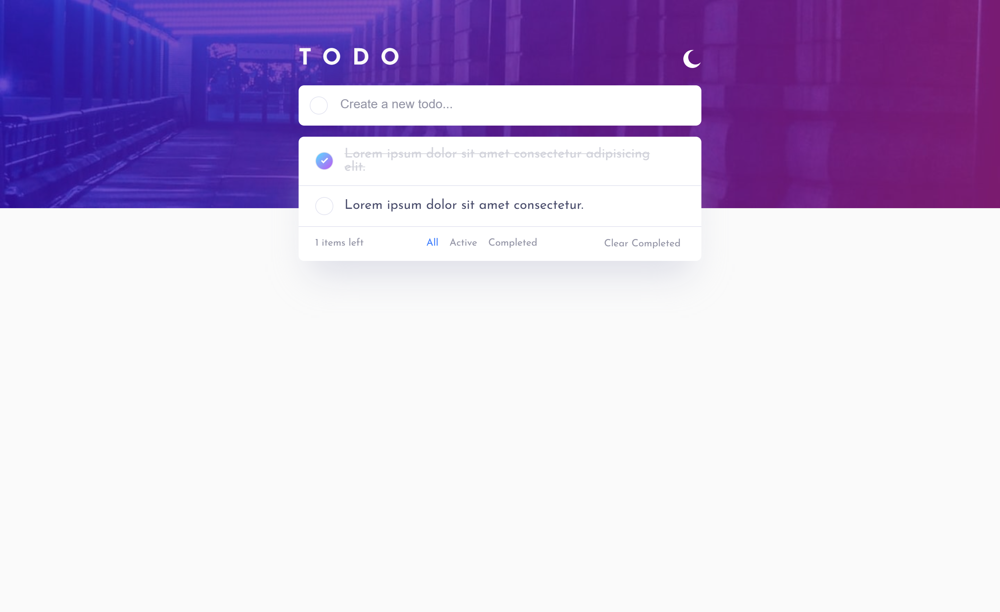
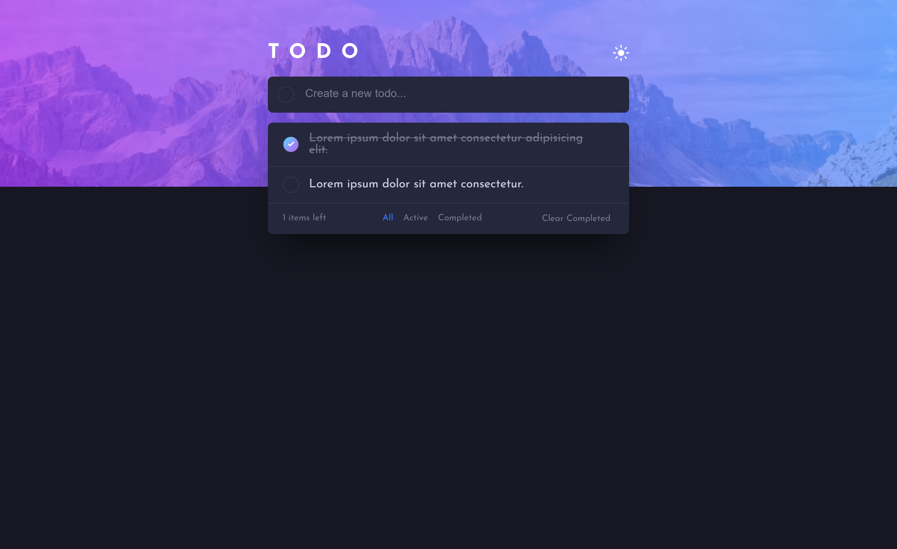

# Frontend Mentor - Todo app solution

This is a solution to the [Todo app challenge on Frontend Mentor](https://www.frontendmentor.io/challenges/interactive-rating-component-koxpeBUmI). Frontend Mentor challenges help you improve your coding skills by building realistic projects. 

## Table of contents

- [Frontend Mentor - Todo app solution](#frontend-mentor---todo-app-solution)
  - [Table of contents](#table-of-contents)
  - [Overview](#overview)
    - [The challenge](#the-challenge)
    - [Screenshot](#screenshot)
    - [Links](#links)
  - [My process](#my-process)
    - [Built with](#built-with)
    - [To clone this project](#to-clone-this-project)
  - [Author](#author)

## Overview

### The challenge

Users should be able to:

- View the optimal layout for the app depending on their device's screen size
- See hover states for all interactive elements on the page
- Add new todos to the list
- Mark todos as complete
- Delete todos from the list
- Filter by all/active/complete todos
- Clear all completed todos
- Toggle light and dark mode
- **Bonus**: Drag and drop to reorder items on the list

### Screenshot




### Links

- Solution URL: [solution](https://github.com/emrebal98/frontend-challenges/tree/todo-app)
- Live Site URL: [demo](https://emrebal98.github.io/frontend-challenges/todo-app/)

## My process

### Built with

- [React](https://reactjs.org/) - JS library

- [Styled Components](https://styled-components.com/) - For styles


### To clone this project

Do the following steps

```bash
# Clone this project
$ git clone -b "todo-app" https://github.com/emrebal98/frontend-challenges.git
```
```bash
# Run the project
$ cd frontend-challenges
$ npm install # Install dependencies
$ npm start

# The client will initialize in the <http://localhost:3000>
```

## Author

- Website - [Emre BAL](https://github.com/emrebal98)
- Frontend Mentor - [@emrebal98](https://www.frontendmentor.io/profile/emrebal98)