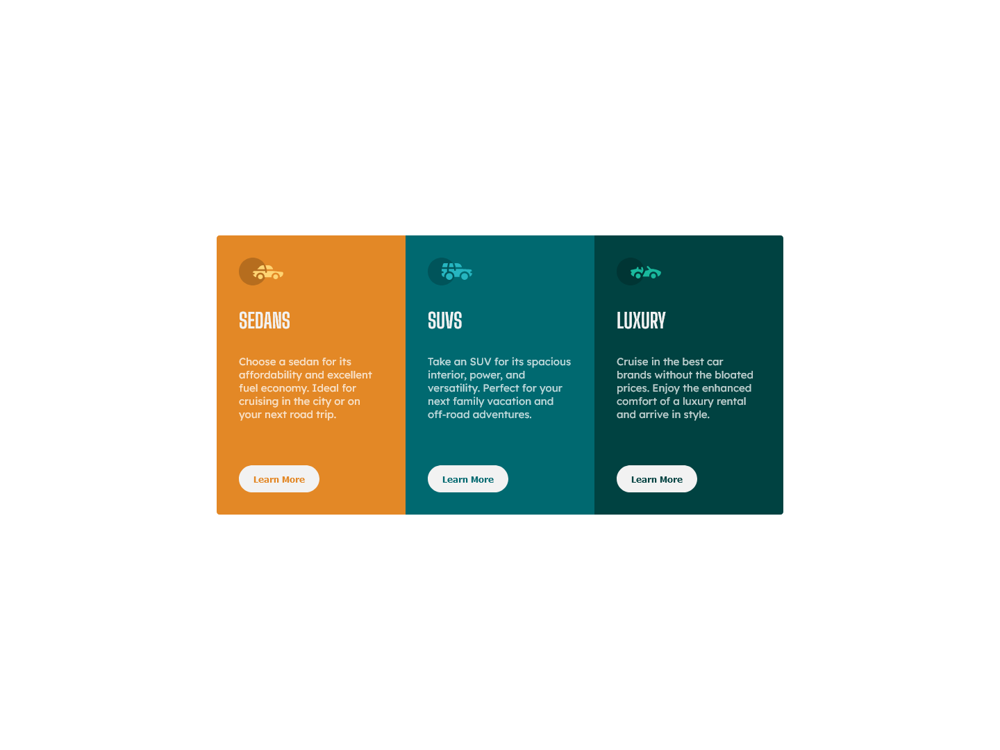

# Frontend Mentor - 3 column preview card components solution

This is a solution to the [3-column preview card component challenge on Frontend Mentor](https://www.frontendmentor.io/challenges/3column-preview-card-component-pH92eAR2-). Frontend Mentor challenges help you improve your coding skills by building realistic projects.

## Table of contents

- [Frontend Mentor - 3 column preview card components solution](#frontend-mentor---3-column-preview-card-components-solution)
  - [Table of contents](#table-of-contents)
  - [Overview](#overview)
    - [The challenge](#the-challenge)
    - [Screenshot](#screenshot)
    - [Links](#links)
  - [My process](#my-process)
    - [Built with](#built-with)
    - [To clone this project](#to-clone-this-project)
  - [Author](#author)

## Overview

### The challenge

Users should be able to:

-   View the optimal layout for the app depending on their device's screen size
-   See hover states for all interactive elements on the page
-   Select and submit a number rating
-   See the "Thank you" card state after submitting a rating

### Screenshot




### Links

-   Solution URL: [solution](https://github.com/emrebal98/frontend-challenges/tree/3-column-preview-card-component)
-   Live Site URL: [demo](https://emrebal98.github.io/frontend-challenges/3-column-preview-card-component/)

## My process

### Built with

-   [React](https://reactjs.org/) - JS library

-   [Sass](https://sass-lang.com/) - For styles

### To clone this project

Do the following steps

```bash
# Clone this project
$ git clone -b "3-column-preview-card-component" https://github.com/emrebal98/frontend-challenges.git
```

```bash
# Run the project
$ cd frontend-challenges
$ npm install # Install dependencies
$ npm start

# The client will initialize in the <http://localhost:3000>
```

## Author

-   Website - [Emre BAL](https://github.com/emrebal98)
-   Frontend Mentor - [@emrebal98](https://www.frontendmentor.io/profile/emrebal98)
